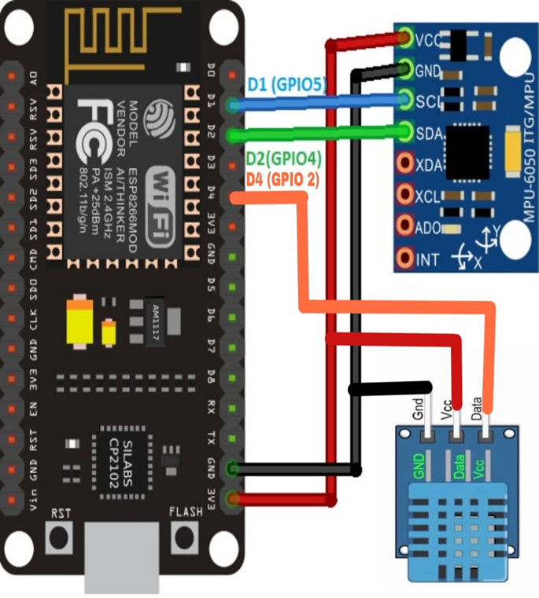

## 🔧 Predictive Maintenance System using IoT & AI
📌 Overview
This project implements a Predictive Maintenance System using ESP8266, DHT11, MPU6050, MQTT, SQLite, and AI models (Isolation Forest & LSTM). It monitors temperature, humidity, and vibration, detects anomalies, and predicts failures to schedule maintenance.

# 🛠 Hardware Components
Component	                 Description
ESP8266	        Microcontroller for IoT connectivity
DHT11	        Temperature and Humidity Sensor
MPU6050	        Accelerometer & Gyroscope(Vibration Monitoring)
DC Motor        (Optional) For simulating real-world machine vibrations
Jumper Wires     For circuit connections
Breadboard	     For prototyping
# 🔌 Connection Diagram

# 1️⃣🌐  HiveMQ MQTT Cloud Setup
•Create a HiveMQ Cloud Account

•Go to HiveMQ Cloud and login (https://www.hivemq.com/pricing/)

•Sign up and create a free cluster.

•Find Your Connection Settings

•After cluster creation, navigate to Connection Settings.

•Note the **Host**, **Port**, **Username**, and **Password**.

•Test MQTT Connection Using Web Client

•Open HiveMQ Web Client.

•Connect using the same credentials.

•Subscribe to topics (sensor/temperature, sensor/humidity, sensor/vibration).

•Publish test messages to verify connectivity.

# 2️⃣ ESP8266 (Hardware) Setup

•Install [Arduino IDE](https://docs.arduino.cc/software/ide-v2/tutorials/getting-started/ide-v2-downloading-and-installing/)

•Add ESP8266 Board Support:

•Go to File → Preferences → Additional Board Manager URLs
Add: http://arduino.esp8266.com/stable/package_esp8266com_index.json

•Install ESP8266 Community Version 2.7.4 in Board Manager.

#include <ESP8266WiFi.h>
#include <PubSubClient.h>
#include <Wire.h>
#include <DHT.h>

•ESP8266WiFi (Built-in)

•PubSubClient (MQTT Communication)

•DHT Sensor Library (For DHT11)
Install required libraries (mentioned above).

•Connect ESP8266 via USB.

•Upload **espmqtt_main.ino** code in Arduino IDE (which includes WiFi & MQTT configuration).
This README now includes everything: HiveMQ setup, ESP8266 code .
