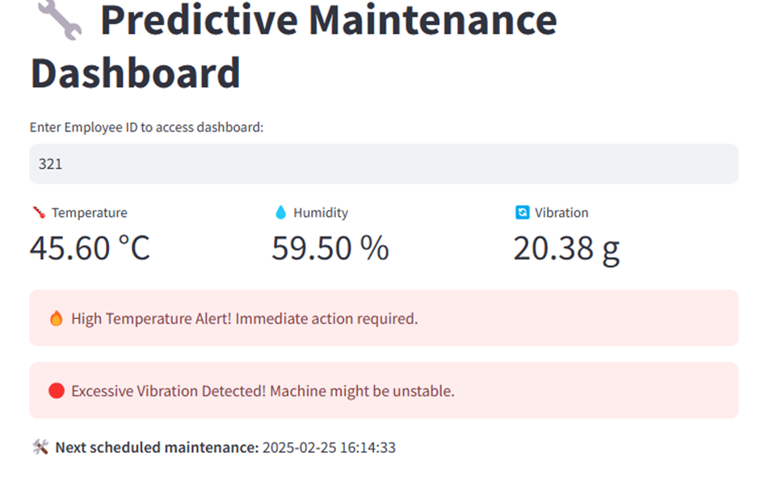
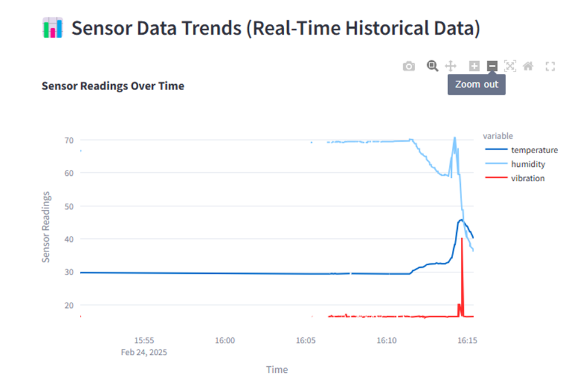

## **📌 Software Setup & Execution**  

This guide explains how to set up and run the software components of the **Predictive Maintenance System** using **MQTT, SQLite, and AI-based anomaly detection**.  

### **1️⃣ Prerequisites**  
Before proceeding, ensure you have the required software installed:  

#### **📦 Required Software & Tools**  
| Software                 | Purpose                                    |
| **Python 3.9+**          | Runs the data processing & AI scripts      |
| **VS Code**              | Recommended for running Python scripts     |
| **SQLite 3.41+**         | Database for storing sensor data           |
| **HiveMQ (MQTT Broker)** | Data transfer between ESP8266 and server   |
| **Streamlit**            | Dashboard for real-time data visualization |

#### **📥 Install Required Python Libraries**  
Run the following command in your terminal:  
```sh
pip install paho-mqtt sqlite3 pandas numpy scikit-learn tensorflow streamlit
```


### **2️⃣ MQTT to SQLite (Data Collection & Storage)**
📌 **Script:** `mqtt2sqlite.py`  
📌 **Purpose:** Captures sensor data from MQTT and stores it in an SQLite database.  

#### **🔹 How to Run**  
Open a terminal in **VS Code** and run:  
```sh
python mqtt2sqlite.py
```

#### **📝 Expected Output**
```sh
Connected to MQTT Broker
Subscribed to Topic: sensor/data
Received Data: {"temperature": 25.3, "humidity": 60, "vibration": 0.01}
Data stored in SQLite: sensor_data.db
```

#### **📂 File Created**  
- **`sensor_data.db`** → SQLite database storing real-time sensor values.

#### **🌍 Where It Runs?**  
- **Runs on your vc code local PC** (Python environment).  
- **Requires MQTT data from ESP8266.**  


### **3️⃣ Anomaly Detection using Isolation Forest**  
📌 **Script:** `IFM.py`  
📌 **Purpose:** Detects anomalies in sensor data using **Isolation Forest Algorithm**.  

#### **🔹 How to Run**  
```sh
python IFM.py
```

#### **📝 Expected Output**
```sh
Fetching data from sensor_data.db...
Model training complete!
Anomalies Detected: 2
```

#### **📂 File Created**  
- **`anomaly_results.csv`** → Stores detected anomalies in CSV format.  

#### **🌍 Where It Runs?**  
- **Runs on your vs code local PC**  
- **Uses SQLite database (`sensor_data.db`) as input**  


### **4️⃣ Data Preprocessing for LSTM Model**  
📌 **Script:** `cleandata.py`  
📌 **Purpose:** Prepares sensor data for **LSTM-based anomaly detection**.  

#### **🔹 How to Run**  
```sh
python cleandata.py
```

#### **📝 Expected Output**
```sh
Cleaning sensor data...
Missing values handled.
Data saved for LSTM training.
```

#### **📂 File Created**  
- **`cleaned_data.csv`** → Cleaned and formatted dataset for LSTM training.  

#### **🌍 Where It Runs?**  
- **Runs on your local PC**  
- **Uses `sensor_data.db` as input**  


### **5️⃣ LSTM Model for Anomaly Prediction**  
📌 **Script:** `lstm_anomaly_detection.py`  
📌 **Purpose:** Uses an **LSTM Neural Network** to predict future failures based on historical sensor data.  

#### **🔹 How to Run**  
```sh
python lstm_anomaly_detection.py
```

#### **📝 Expected Output**
```sh
Training LSTM model...
Model trained successfully!
Predictions saved.
```

#### **📂 File Created**  
- **`lstm_model.h5`** → Trained LSTM model file.  
- **`lstm_predictions.csv`** → Predicted anomalies.  

#### **🌍 Where It Runs?**  
- **Runs on your local PC**  
- **Uses `cleaned_data.csv` for training**  


### **6️⃣ Real-Time Dashboard (Visualization & Alerts)**  
📌 **Script:** `Predictive_Maintenance_Dashboard.py`  
📌 **Purpose:** Displays **real-time sensor data, anomaly alerts, and predictions** on a web-based UI using Streamlit.  

#### **🔹 How to Run**  
```sh
streamlit run Predictive_Maintenance_Dashboard.py
```

#### **🌍 Where It Runs?**  
- **Runs in a Web Browser**  
- **Access the dashboard at:** `http://localhost:8501`  


## **📂 File Summary (After Running All Scripts)**  

| File Name                   | Purpose |
| `sensor_data.db`            | Stores raw sensor data (from `mqtt2sqlite.py`) |
| `anomaly_results.csv`       | Stores detected anomalies (from `IFM.py`) |
| `cleaned_data.csv`          | Preprocessed data for LSTM (from `cleandata.py`) |
| `lstm_model.h5`             | Trained LSTM model (from `lstm_anomaly_detection.py`) |
| `lstm_predictions.csv`      | Predicted anomalies (from `lstm_anomaly_detection.py`) |

---

## **✅ Final Summary**
- **Run scripts in order** → `mqtt2sqlite.py` → `IFM.py` → `cleandata.py` → `lstm_anomaly_detection.py` → `Predictive_Maintenance_Dashboard.py`
- **All files are automatically created** in your project folder.
- **Dashboard provides real-time alerts & visualizations.**





